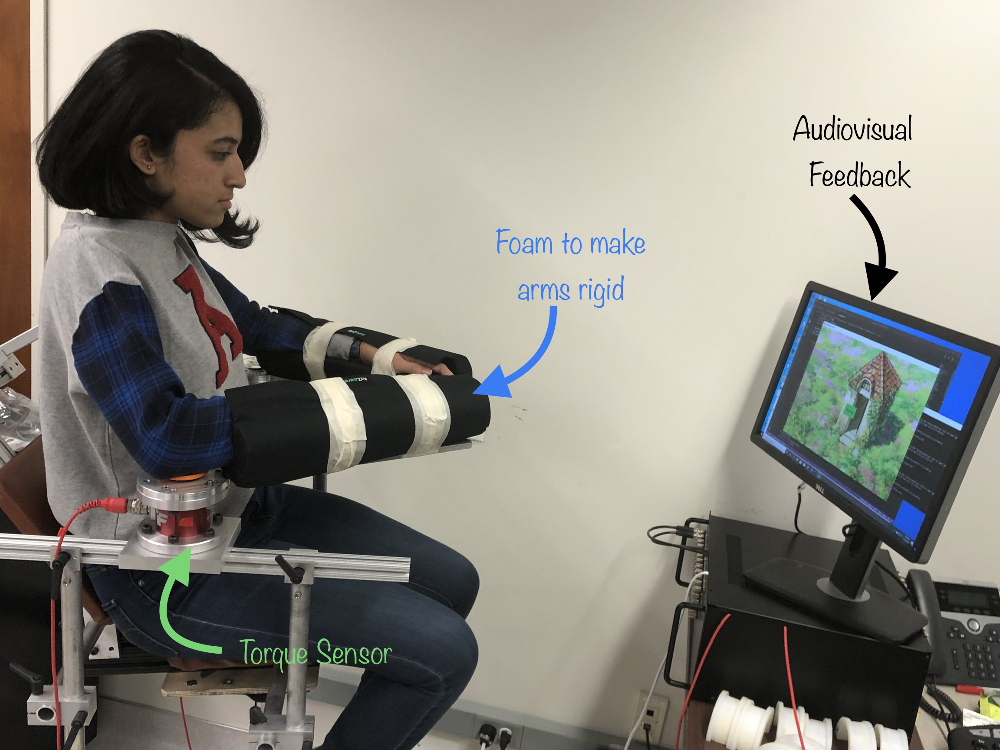
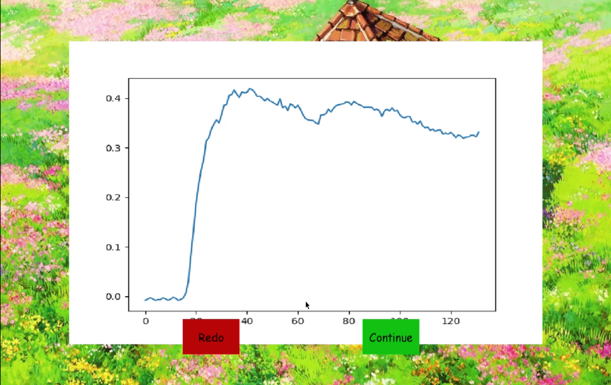

# Development of a mechatronic system to study proprioception in children

#### _Jingyan Ling_
**-March ~ December 2019**

- [Method](#method)
  - [Hardware Setup](#hardware-setup)
  - [System Pipeline](#system-pipeline)

- [Demo and Result](#demo-and-result)

- [Software Structure & Included packages](#packages-breakdown)

- [Implementation Instruction](#implementation-instruction)

The objective of this project is to build a mechatronic system to study proprioception in young children. This system includes a mechanical design for the experimental setup, and software for acquiring sensor data and delivering automated audiovisual feedback. The targeted age of children is between 3 and 6 years old. The developed system provides visually attractive interfaces that adapt to the participant’s interactions. The experiment contains a test to quantify a participant’s maximum voluntary torque, as well as their perception. This system runs an automated experiment and records data for post-hoc analyses.

#### Motivation

Numerous studies have quantified proprioception in adults. However, less information is available about children. The goal of this project is to develop an experiment to permit proprioception to be quantified in children. The long-term goal of this project is to, using the system developed, understand the extent to which children who have neurological impairments also have proprioceptive deficits.

## Method

#### Hardware Setup

#### System Pipeline

The system acquires torque data indicating the extent to which the participant is flexing and extending about each elbow joint through two torque sensors. We used a DAQ card for data acquisition. A python script streams the sensory data at 1000Hz and passes signals to a callback function. The callback function utilizes the linear equation resulted from the [calibration](calibration/README.md) process to convert a voltage signal to the actual torque generated by the participant. A zeroing function can also be called to remove an offset in the voltage signal. The perceptual testing tasks use the results from the maximum voluntary torque test (maximum torque), as well as the real-time torque to determine the audiovisual feedback. The system renders the visual interface at 27Hz and records data at 1000Hz. 

## Demo and Result

- One can find a demo video at [here](https://youtu.be/ntOk0ySuN0E)
  
- Data recorded for further research in the format of  ` | Right Arm Torque | Left Arm Torque | Activity | Time Stamp | `
 

## Packages Breakdown

#### NIstreamer

- This is a Python library to stream data from the DAQ card channels at a desired frequency
- Signals from the DAQ card can be further proceeded by calling callback functions
- Artificial data streaming is available in the package without connecting to a DAQ card 

#### ni_stream.py

- The script serves as a callback function of the `NIstreamer` package
- The script calls a maximum voluntary torque test first to obtain offset and maximum torque data for the perceptual testing tasks.
- The script listens to a flag message from interfaces and triggers the recorder to write data in files with a desired frequency
- All interfaces are rendered at 27Hz

#### max_test.py
- This script creates an interface and provides audiovisual feedback to the participant for a maximum torque test
- This script returns the bias of the raw signal and the maximum torque generated by the participant's reference arm
-  

#### arm_game.py
- This script creates an interface and provides audiovisual feedback to the participant for perceptual testing tasks
- The participant is asked to generate a torque larger than 40% of their maximum torque by the reference arm to remove the dirt on a picture (Phase 1)
- The participant is asked to use the indicative arm to generate a torque that is the same strength of the torque generated in Phase 1 without audiovisual feedback 
-  

## Implementation Instruction

- Change file names you would like to save in `ni_stream.py`

~~~
python ni_stream.py
~~~

#### Change Interfaces

To add more pictures for the perceptual testing tasks:
-  add an image to the directory: ` armproj_ws\img\ `
-  append the new image name to the `showpic` variable of the `showpic_generator` class in `arm_game.py`

#### Test environment

Hardware:

- DAQ ##
- Torque sensor ##

Software:
- Windows Machine
- Python 3.6

Package Requirement:
- pygame (python)
- nidaqmx (python)
