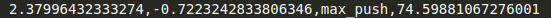

# A mechatronic system to study proprioception in children

#### _Jingyan Ling_
**-March ~ December 2019**

- [Method](#method)
  - [Hardware Setup](#hardware-setup)
  - [System Pipeline](#system-pipeline)

- [Demo and Result](#demo-and-result)

- [Software Structure & Included packages](#packages-breakdown)

- [Implementation Instruction](#implementation-instruction)

The objective of this research is to build a mechatronic system to study proprioception in children. This system includes a mechanical design for the experiment setup, and a software system that acquires bio-data also delivers visual feedback. The aiming subject in this research is children between 3 to 6 years old. This system that provides visually attractive interfaces allows the participant to stay focus on the experimental tasks. The experiment contains a maximum torque test and perceptual testing tasks. This system carries on the experiment and records data for further research.

#### Motivation

Adults with stroke usually lose their ability to do sensorimotor tasks. Studies state that the brain of an adult has been developed well to achieve particular proficiency in limb movement patterns. Researches have shown that the human brain develops primary sensory and motor skills in one's early ages. In children, there is a higher chance that one can still perform functional sensorimotor tasks even with stroke. This project sets up an experiment to obtain data while children are performing sensorimotor tasks, ultimately, to understand the neuroplasticity of children with stroke.

## Method

#### Hardware Setup

- PLACEHOLDER

#### System Pipeline

The system acquires data of the subject's upper limb performance through two torque sensors. We used a DAQ card for data acquisition. A python script streams the sensory data at 1000Hz and passes signals to a callback function. The callback function utilizes the linear equation resulted from the [calibration](calibration/README.md) process to convert a voltage signal to actual torque generated by the subject. It also calls a zeroing function before rendering any interface for bias issues. The perceptual testing tasks use the result from the maximum torque test (maximum torque) and real-time torque to determine the visual feedback. The system renders interfaces at 27Hz and recording data at 1000Hz. 

## Demo and Result

- One can find a demo video at [here]()
  
- Data recorded for further research in the format of  ` | Right Arm Torque | Left Arm Torque | Activity | Time Stamp | `
 

## Packages Breakdown

#### NIstreamer

- This is a Python library to stream data from the DAQ card channels at a desired frequency
- Signals from the DAQ card can be further proceeded by calling callback functions
- Artificial data streaming is available in the package without connecting to a DAQ card 

#### ni_stream.py

- The script serves as a callback function of the `NIstreamer` package
- The script calls a maximum torque test first to obtain offset and maximum torque data for the perceptural testing tasks.
- The script listens to a flag message from interfaces and triggers the recorder to write data in files with a desired frequency
- All interfaces are rendered at 27Hz

#### max_test.py
- This script creates an interface and provides audiovisual feedback to the participant for a maximum torque test
- This script returns the bias of the raw signal and the maximum torque generated by the participant's reference arm

#### arm_game.py
- This script creates an interface and provides audiovisual feedback to the participant for perceptual testing tasks
- The participant is asked to generate a torque larger than 40% of their maximum torque by the reference arm to remove the dirt on a picture (Phase 1)
- The participant is asked to use the indicative arm to generate a torque that is the same strength of the torque generated in Phase 1 without audiovisual feedback 

## Implementation Instruction

- Change file names you would like to save in `ni_stream.py`

~~~
python ni_stream.py
~~~

#### Change Interfaces

To add more pictures for the perceptual testing tasks:
-  add an image to the directory: ` armproj_ws\img\ `
-  append the new image name to the `showpic` variable of the `showpic_generator` class in `arm_game.py`

#### Test environment

Hardware:

- DAQ ##
- Torque sensor ##

Software:
- Windows Machine
- Python 3.6

Package Requirement:
- pygame (python)
- nidaqmx (python)
