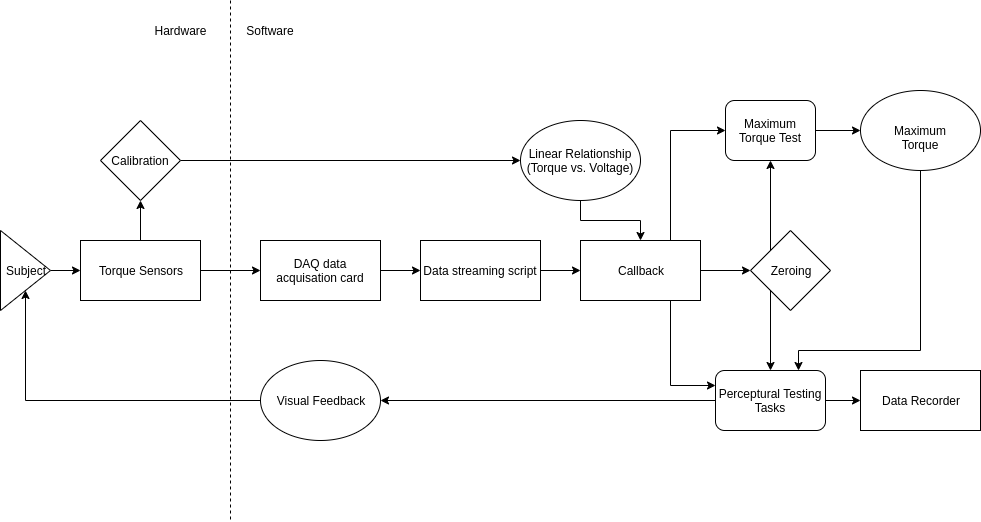

# A mechatronic system to study proprioception in children

#### _Jingyan Ling_
**-March ~ December 2019**

- [Method](#method)
  - [Hardware Setup](#hardware-setup)
  - [System Pipeline](#system-pipeline)

- [Demo](#demo)

- [Software Structure & Included packages](#high-level-description--included-packages)

- [Implementation Instruction](#implementation-instruction)

The objective of this research is to build a mechatronic system to study proprioception in children. This system includes a mechanical design for the experiment setup, and a software system that acquires bio-data also delivers visual feedback. The aiming subject in this research is children between 3 to 6 years old. This system that provides visually attractive interfaces allows the participant to stay focus on the experimental tasks. The experiment contains a maximum torque test and perceptual testing tasks. This system carries on the experiment and records data for further research.

#### Motivation

Adults with stroke usually lose their ability to do sensorimotor tasks. Studies state that the brain of an adult has been developed well to achieve particular proficiency in limb movement patterns. Researches have shown that the human brain develops primary sensory and motor skills in one's early ages. In children, there is a higher chance that one can still perform functional sensorimotor tasks even with stroke. This project sets up an experiment to obtain data while children are performing sensorimotor tasks, ultimately, to understand the neuroplasticity of children with stroke.

## Method

#### Hardware Setup

- PLACEHOLDER

#### System Pipeline

The system acquires data of the subject's upper limb performance through two torque sensors. We used a DAQ card for data acquisition. A python script streams the sensory data at 1000Hz and passes signals to a callback function. The callback function utilizes the linear equation resulted from the [calibration](calibration/README.md) process to convert a voltage signal to actual torque generated by the subject. It also calls a zeroing function before rendering any interface for bias issues. The perceptual testing tasks use the result from the maximum torque test (maximum torque) and real-time torque to determine the visual feedback. The system renders interfaces at 27Hz and recording data at 1000Hz. 

### Demo

## High-level description & Included packages

## Implementation Instruction
#### Test environment

Hardware:

- DAQ ##
- Torque sensor ##

Software:
- Windows Machine
- Python 3.6

Package Requirement:
- pygame (python)
- nidaqmx (python)
