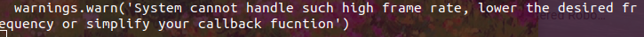

# children_ability_assessment_sys
## Engineering Journal
#### Jingyan Ling

## 10/10/2019

- Solving problems:
  - 1. sending flag from interface to recorder (tested)
  - 2. record only valuable raw torque to csv file (tested)
  - 3. record tag to indicate current activity while writing into csv file (tested)

- The logic of the gamer interface is called in `interface.py` in an infinity loop that takes `filtered signal` as an input
- TODO:
  - solve the issue that real-time data plotting with `matplotlib` for filter testing
  - Test with actual NI data acquisition

## 10/09/2019

- Solving data networking with servers
- Networking diagram
- Issue Reported:
  - When doing calibration, linear equation was made to convert raw voltage to torque. Is it accurate to use same equation for filtered voltage?
- Networking using three ports:
  - Raw port (from streamer to raw recorder)
  - Filtered port (from streamer to game interface)
  - Record flag port (from interface to raw recorder)
- Raw port has been tested
    - Issue reported:
      - using `matplotlib` for real-time plotting is very slow
      - Try some other tool, or use ROS RQT for plot only

## 10/08/2019

- Put game in the single thread callback function get warning even with data acquisition frame rate at `100Hz`
- 
- Two options now:
  - Multi-thread
  - Server
  

## 10/07/2019

- Convert the scripts to single thread and test if the computer has enough capability.
- Use the script `ni_stream.py` for total control
- Issue report:
  - Inside the `game_logic` loop, how `pygame clock` runs 

## 10/02/2019

- Test `rostopic` publishing raw data from Ni-daq
  - Maximum frequency can publish is around 47 Hz

- Looking for ROS replacement for data communication
  - Try `socket` for data networking 

- Socket 
  - UDP is able to send float array with `json`
  - Specify frame rate of `talker` scripts
    - `while loop` with specific frequency (?)
    - Current issue: only one listener can receive data from one talker

- multiple thread package for Python
  python threading module / python multi-process
  
- Structure:
  - one script that streams raw data in a loop with specified frequency and calls the callback function to do signal processing
  - one script that **imports** the streamer and specify callback functions (raw, filtered, ...), **publishes** the data in the callback function to a port
  - Interface scripts can listen to a port and proceed.

- When adding multiple channels to ni-daq task python API, module `read()` will return a list
  
## 09/25 - 09/30/2019

- NI-data acquisition card with ROS
- Add dependency: nidaqmx (python package)

- Filtered data:
  - INFO NEEDED: NI-DAQ card sample rate (fs)
  - determine moving window size
  - determine filtered data update frequency
  
- TODO:
  - Add ROS customize message type for multiple channel data
  - plot using RQT

## 09/24/2019

- ROS with Windows
  - Visual Studio 2019 version has been changed on the windows machine
  - The shortcut of `cmd` has been changed from `...\Community\...` to `...\Professional\...`
- Shortcut has been tested and able to run `rosnode`
  - `publisher` works with a sample string
- Potential Issues:
  - Any `ros` command responses much slower than before, check if there will be a lag issue when do data streaming.
  - The directory has to be changed to the executable to run the node.
  
- Re-arrange github to update scripts from Linux and Windows 
  - Keep the `build` and `devel` of `ROS` locally
  - `git pull` to update scripts only
  - Check `gitignore` for detail
- To run package from windows machine:
  - Now shares the same repo as Linux version
  - Need to source the `...\devel\setup.bat` every time

- TODO
  - Implement the NI-data acquisition card python API to a `rosnode`